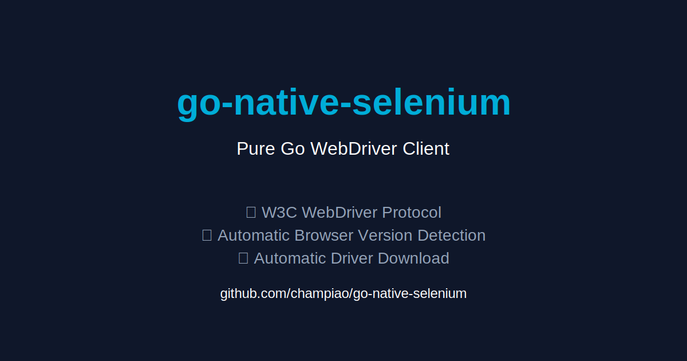

> Lightweight **native Go implementation of the W3C WebDriver protocol**
> for modern browser automation.

`go-native-selenium` provides a clean and dependency-light alternative
to traditional Selenium bindings by implementing the **WebDriver
protocol directly in Go**.

It is designed for:

-   End‑to‑End testing
-   Browser automation
-   CI/CD pipelines
-   Web scraping
-   QA regression testing

------------------------------------------------------------------------

## ✨ Features

### 🚀 Native WebDriver Implementation

-   Pure Go HTTP implementation of the **W3C WebDriver protocol**
-   No Selenium Java server dependency
-   Lightweight and fast

### 🔎 Smart Element Locators

Supports common WebDriver strategies:

-   `ByID`
-   `ByCSSSelector`
-   `ByName` *(Python-style translation)*

Example:

``` go
email, _ := client.FindElement(webdriver.ByName, "email")
```

Automatically translated to:

``` css
[name="email"]
```

------------------------------------------------------------------------

### ⏳ Resilient Synchronization

Modern frontends like **React, Vue and SPA frameworks** require reliable
synchronization.

The library includes:

-   Explicit waits
-   Polling based conditions
-   Timeout control
-   Elimination of `time.Sleep()` anti‑patterns

Example:

``` go
wait := client.NewWait(10 * time.Second)

email, err := wait.Until(
    client.UntilElementLocated(
        webdriver.ByCSSSelector,
        "input[type='text']",
    ),
)
```

------------------------------------------------------------------------

### 🔐 Authentication Persistence

Supports cookie manipulation for faster automation flows.

Capabilities:

-   Capture browser cookies
-   Inject cookies into sessions
-   Skip login screens

Ideal for:

-   QA automation
-   Authenticated scraping
-   CI test pipelines

------------------------------------------------------------------------

### 📸 Evidence Collection

Built‑in screenshot support.

``` go
client.Screenshot("evidence.png")
```

Features:

-   WebDriver Base64 screenshot capture
-   Automatic PNG conversion
-   Ideal for CI failure logs

------------------------------------------------------------------------

## 🧱 Project Structure

    go-native-selenium/
    │
    ├── cmd/
    │   └── demo.go
    ├── driver/
    │   ├── chrome.go
    │   ├── downloader.go
    │   ├── fetcher.go
    │   └── manager.go
    │
    ├── webdriver/
       ├── cookies.go
       ├── elements.go
       ├── javascript.go
       ├── navigation.go
       ├── options.go
       ├── screenshot.go
       ├── session.go
       ├── timeouts.go
       ├── wait.go
       └── window.go
    

------------------------------------------------------------------------

## ⚙️ Driver Management

Automatically detects the installed Chrome version and ensures a
compatible ChromeDriver is used.

Example:

``` go
chromeVersion, err := driver.GetChromeVersion()
if err != nil {
    panic(err)
}

driverPath, err := driver.DownloadDriver(chromeVersion)
if err != nil {
    panic(err)
}

service, err := driver.StartService(driverPath)
if err != nil {
    panic(err)
}
defer service.Stop()
```

------------------------------------------------------------------------

## 🧪 Creating a WebDriver Session

``` go
caps := webdriver.DefaultCapabilities()

caps.AddArgument("--headless=new")
caps.AddArgument("--disable-gpu")

client, err := webdriver.NewSession(service.URL, caps)
if err != nil {
    panic(err)
}

defer client.Quit()
```

Headless mode is recommended for **CI/CD environments**.

------------------------------------------------------------------------

## 🧪 Example: End‑to‑End Login Flow

``` go
client.Navigate("https://example.com/login")

wait := client.NewWait(10 * time.Second)

email, err := wait.Until(
    client.UntilElementLocated(
        webdriver.ByCSSSelector,
        "input[type='text']",
    ),
)

if err != nil {
    panic(err)
}

email.SendKeys("champiao@example.com")

client.Screenshot("evidence.png")
```

------------------------------------------------------------------------

## 🛠 Debugging Tips

### Always Check Errors

``` go
el, err := client.FindElement(...)
if err != nil {
    return err
}

el.SendKeys("value")
```

------------------------------------------------------------------------

## 📦 Use Cases

-   End‑to‑End testing
-   CI automation
-   Browser workflows
-   Scraping authenticated systems
-   Regression testing

------------------------------------------------------------------------

## ⚠️ Current Limitations

Current implementation targets:

-   Linux environments
-   Chrome based browsers

Future improvements may include:

-   macOS support
-   Windows support
-   Firefox WebDriver support
-   Remote WebDriver endpoints

------------------------------------------------------------------------

## 🧭 Roadmap

Planned improvements:

-   Parallel session support
-   Structured logging
-   Network interception
-   HAR capture
-   Performance metrics
-   Playwright‑like debugging tools

------------------------------------------------------------------------

## 📄 License

This project is licensed under the **MIT License**.

You are free to:

-   Use
-   Modify
-   Distribute
-   Use commercially

As long as the original license is included.

------------------------------------------------------------------------

## 🤝 Contributing

Contributions are welcome.

Typical workflow:

1.  Fork the repository
2.  Create a feature branch
3.  Commit changes
4.  Submit a pull request

------------------------------------------------------------------------

## 🧠 Philosophy

`go-native-selenium` focuses on:

-   simplicity
-   reliability
-   Go idiomatic design
-   minimal dependencies

The goal is to provide a **clean and modern WebDriver experience for Go
developers**.
